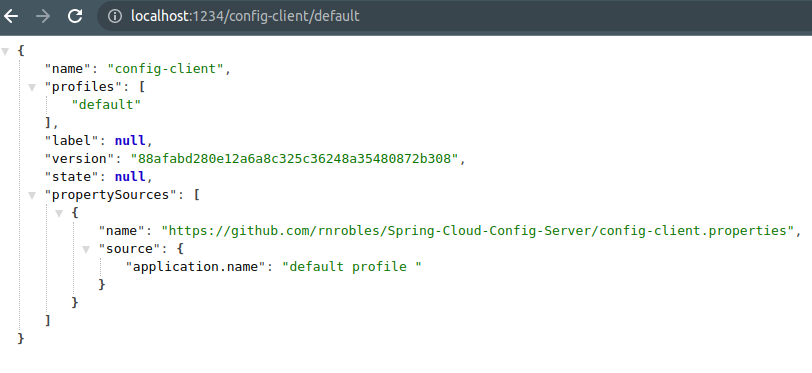
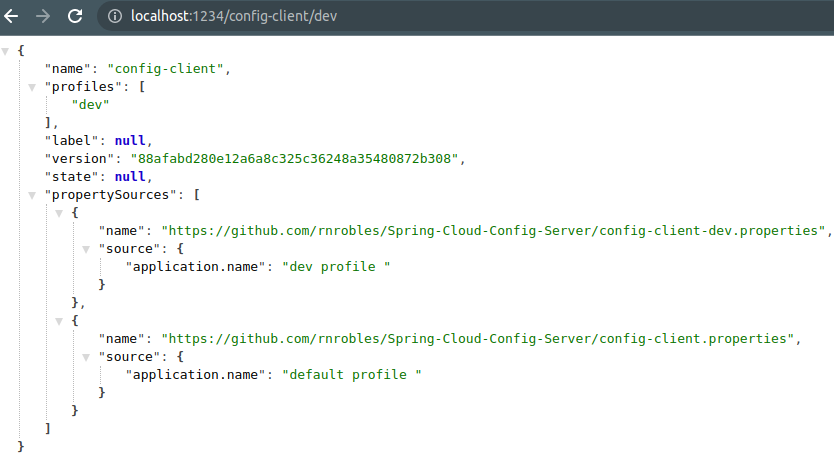

# Spring-Cloud-Config-Server
Pruebas con un servidor de configuración 

# Porque Config-Server?

El siguiente servidor de configuración nos permite que un sistema distribuido solicite la configuración al servidor, con lo cual nos permite realizar cambios al vuelo y asi no tener que volver a levantar los servicios

# Creación del Servidor 

Lo primero es crear un proyecto por medio del asistente con la única dependencia de Config Server


En la clase principal unicamente se añade la anotación @EnableConfigServer


```java
package online.rnrobles.configserver;

import org.springframework.boot.SpringApplication;
import org.springframework.boot.autoconfigure.SpringBootApplication;
import org.springframework.cloud.config.server.EnableConfigServer;

@SpringBootApplication
@EnableConfigServer
public class ConfigServerApplication {

	public static void main(String[] args) {
		SpringApplication.run(ConfigServerApplication.class, args);
	}

}
```
y en el archivo **application.properties** 

````
spring.cloud.config.server.git.uri=https://github.com/rnrobles/Spring-Cloud-Config-Server
spring.cloud.config.server.git.clone-on-start=true
spring.cloud.config.server.default-label=main

server.port=1234
````

spring.cloud.config.server.git.uri: Ruta donde se almacenan las configuraciones
spring.cloud.config.server.git.clone-on-start: Si realiza una copia cuando se inicia el servidor
spring.cloud.config.server.default-label: la rama del repositorio
server.port: puerto donde se levanta el servidor de configuración 

en el repositorio tenemos los siguientes archivos con estas configuraciones

config-client.properties

````
application.name = default profile 

````

config-client-prod.properties

````
application.name = prod profile

````

config-client-prod.properties

````
application.name = dev profile 

````

y de acuerdo a la ruta que especifiquemos, obtendremos una u otra configuración





