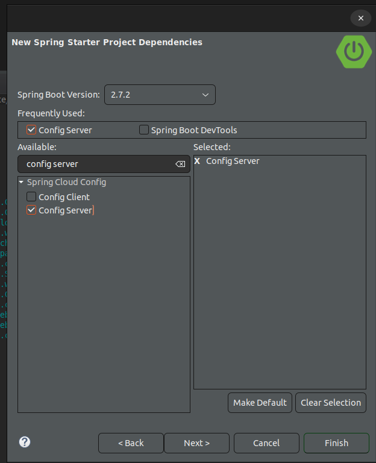

# Spring-Cloud-Config-Server
Pruebas con un servidor de configuración 

# Porque Config-Server?

El siguiente servidor de configuración nos permite que un sistema distribuido solicite la configuración al servidor, con lo cual nos ahorra volver a levantar los servicios o realizar cambios al vuelo

# Creación del Servidor 

Lo primero es crear un proyecto por medio del asistente con la única dependencia de Config Server

