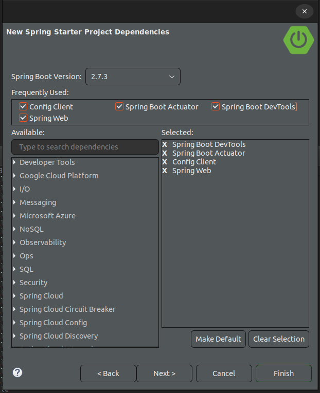

# Spring-Cloud-Config-Server
Pruebas con un servidor de configuración 

# Porque Config-Server?

El siguiente servidor de configuración nos permite que en un sistema distribuido existan clientes que soliciten la configuración al servidor, con lo cual podríamos realizar cambios al vuelo y así no reiniciar los servicios por un cambio en su configuración

# Creación del Servidor 

Lo primero es crear un proyecto por medio del asistente con la única dependencia de Config Server


En la clase principal unicamente se añade la anotación @EnableConfigServer


```java
package online.rnrobles.configserver;

import org.springframework.boot.SpringApplication;
import org.springframework.boot.autoconfigure.SpringBootApplication;
import org.springframework.cloud.config.server.EnableConfigServer;

@SpringBootApplication
@EnableConfigServer
public class ConfigServerApplication {

	public static void main(String[] args) {
		SpringApplication.run(ConfigServerApplication.class, args);
	}

}
```
y en el archivo **application.properties** 

````
spring.cloud.config.server.git.uri=https://github.com/rnrobles/Spring-Cloud-Config-Server
spring.cloud.config.server.git.clone-on-start=true
spring.cloud.config.server.default-label=main

server.port=1234
````

spring.cloud.config.server.git.uri: Ruta donde se almacenan las configuraciones
spring.cloud.config.server.git.clone-on-start: Si realiza una copia cuando se inicia el servidor
spring.cloud.config.server.default-label: la rama del repositorio
server.port: puerto donde se levanta el servidor de configuración 

en el repositorio tenemos los siguientes archivos con estas configuraciones

config-client.properties

````
application.name = default profile 

````

config-client-prod.properties

````
application.name = prod profile

````

config-client-prod.properties

````
application.name = dev profile 

````

y de acuerdo a la ruta que especifiquemos, obtendremos una u otra configuración


# Config-Client

Una vez que tenemos el servidor de configuración corriendo, podemos crear un cliente que use estas configuraciones, para ello agregamos las siguientes dependencias




Config Client habilita el cliente de configuracion
Spring Boot Actuator Habilita algunos endpoints para poder recargar las configuraciones, entre otros mas
Spring Boot DevTools Nos ayuda a recargar el servicio cuando realizamos cambios en desarrollo


y en el archivo application.properties añadimos los siguientes valores


````
spring.application.name=config-client
spring.profiles.active=prod
spring.config.import=optional:configserver:http://localhost:1234
management.endpoints.web.exposure.include=*
server.port=1112

````

spring.application.name: es el nombre del archivo de nuestras configuraciones
spring.profiles.active: es el perfil activo
spring.config.import=optional:configserver: ruta de nuestro servidor, con optional evitamos una excepción si no esta disponible el servidor
management.endpoints.web.exposure.include: expone los endpoints de actuator
server.port: puerto donde inicia el cliente


a continuación creamos una clase donde podemos leer los valores de configuración


```java
package online.rnrobles.configclient.config;

import org.springframework.beans.factory.annotation.Value;
import org.springframework.boot.context.properties.ConfigurationProperties;
import org.springframework.cloud.context.config.annotation.RefreshScope;
import org.springframework.stereotype.Component;

@Component
@ConfigurationProperties
@RefreshScope
public class configApp {
	
	@Value("${application.name}")
	private String name;

	public String getName() {
		return name;
	}
	public void setName(String name) {
		name = name;
	}
}

```

En la propiedad name por medio de la anotación @Value("${application.name}") que corresponde al nombre de la propiedad en nuestro archivo de configuraciones podemos leer su valor

la anotación @RefreshScope nos servirá para actualizar el valor por medio de un POST en la ruta /actuator/refresh

Posteriormente creamos un controlador que al acceder a la ruta /api no devuelva el valor de la propiedad name

```java
package online.rnrobles.configclient.controller;

import org.slf4j.Logger;
import org.slf4j.LoggerFactory;
import org.springframework.beans.factory.annotation.Autowired;
import org.springframework.web.bind.annotation.GetMapping;
import org.springframework.web.bind.annotation.RequestMapping;
import org.springframework.web.bind.annotation.RestController;

import online.rnrobles.configclient.config.configApp;

@RestController
@RequestMapping("/api")
public class ConfigController {
	
	private static final Logger log = LoggerFactory.getLogger(ConfigController.class);

	@Autowired
	configApp config;
	
	@GetMapping
	public String getConfiguracion()
	{
		log.info(config.getName());
		return config.getName();
	}
}

```
al realizar la consulta nos muestra los siguientes valores de acuerdo al perfil que activemos

````
spring.profiles.active=prod

````


````
spring.profiles.active=default

````

